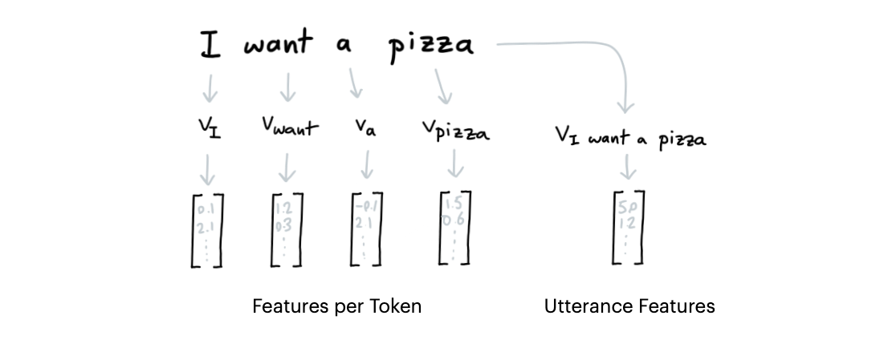

# **Rasa NLU Examples**

This repository contains some example components meant for educational and inspirational
purposes. These are components that we open source to encourage experimentation but
these are components that are **not officially supported**. There will be some tests
and some documentation but this is a community project, not something that is part of core Rasa.

The goal of these tools will be to be compatible with the most recent version of
rasa only. You may need to point to an older release of the project if you want
it to be compatible with an older version of Rasa.

The following components are implemented.

## **Tokenizers**

Tokenizers can split up the input text into tokens. Depending on the Tokenizer that you pick
you can also choose to apply lemmatization. For languages that have rich grammatical features
this might help reduce the size of all the possible tokens.

- **`rasa_nlu_examples.tokenizers.StanzaTokenizer`** [docs](docs/tokenizer/stanza/)
- **`rasa_nlu_examples.tokenizers.ThaiTokenizer`** [docs](docs/tokenizer/thai_tokenizer/)

## **Featurizers**

Dense featurizers attach dense numeric features per token as well as to the entire utterance. These
features are picked up by intent classifiers and entity detectors later in the pipeline.

- **`rasa_nlu_examples.featurizers.dense.FastTextFeaturizer` [docs](docs/featurizer/fasttext/)**
- **`rasa_nlu_examples.featurizers.dense.BytePairFeaturizer` [docs](docs/featurizer/bytepair/)**
- **`rasa_nlu_examples.featurizers.dense.GensimFeaturizer` [docs](docs/featurizer/gensim/)**
- **`rasa_nlu_examples.featurizers.sparse.SemanticMapFeaturizer` [docs](docs/featurizer/semantic_map/)**

## **Intent Classifiers**

Intent classifiers are models that predict an intent from a given user message
text.  The default intent classifier in Rasa NLU is the [DIET
model](https://rasa.com/docs/rasa/components#dietclassifier-2) which can be
fairly computationally expensive, especially if you do not need to detect
entities.  We provide some examples of alternative intent classifiers here.

**`rasa_nlu_examples.classifiers.SparseNaiveBayesIntentClassifier` [docs](docs/classifier/sparsenb.md)**

## **Entity Extractors**

- **`rasa_nlu_examples.extractor.FlashTextEntityExtractor`** [docs](docs/extractors/flashtext/)

## **Fallback Classifiers**

- **`rasa_nlu_examples.fallback.FasttextLanguageFallbackClassifier` [docs](docs/fallback/fasttextlanguagefallback.md)**

## **Meta**

The components listed here won't effect the NLU pipeline but they might instead cause extra logs
to appear to help with debugging.

- **`rasa_nlu_examples.meta.Printer` [docs](docs/meta/printer/)**
- **`rasa_nlu_examples.scikit.RasaClassifier` [docs](docs/jupyter/tools/#rasa_nlu_examples.scikit.classifier.RasaClassifier)**
- **`from rasa_nlu_examples.scikit.dataframe_to_nlu_file` [docs](docs/jupyter/tools/#rasa_nlu_examples.scikit.common.dataframe_to_nlu_file)**
- **`from rasa_nlu_examples.scikit.nlu_path_to_dataframe` [docs](docs/jupyter/tools/#rasa_nlu_examples.scikit.common.nlu_path_to_dataframe)**

## **Name Lists**

Language models in spaCy are typically trained on Western news datasets. That means
that the reported benchmarks might not apply to your use-case. For example; detecting
names in texts from France is not the same thing as detecting names in Madagascar. Even
thought French is used actively in both countries, the names of it's citizens might
be so different that you cannot assume that the benchmarks apply universally.

To remedy this we've started collecting name lists. These can be used as a lookup table
which can be picked up by Rasa's [RegexEntityExtractor](https://rasa.com/docs/rasa/components#regexentityextractor)
or our [FlashTextEntityExtractor](docs/extractors/flashtext/).
It won't be 100% perfect but it should give a reasonable starting point.

You can find the namelists [here](https://github.com/RasaHQ/rasa-nlu-examples/tree/master/data/namelists).
We currently offer namelists for the United States, Germany as well as common Arabic names.
Feel free to submit PRs for more languages. We're also eager to receive feedback.

## Contributing

You can find the contribution guide [here](https://rasahq.github.io/rasa-nlu-examples/contributing/).
